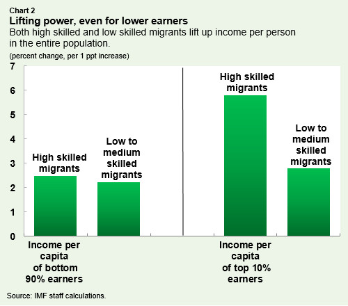

North America’s future prosperity could be supercharged by a bold idea: completely open labor mobility. Imagine U.S., Canadian, and Mexican companies freely hiring the best workers from anywhere in the world, without visas or quotas. This isn’t a distant fantasy but an extension of North America’s heritage as a land of opportunity. Embracing fully open immigration would unleash significant economic benefits – faster GDP growth, a younger and more dynamic labor force, and a surge of entrepreneurship and innovation – while also bolstering public finances and spreading prosperity to immigrants’ home countries. Below, we dive into the evidence and theory showing why tearing down labor mobility barriers would be a win-win for North America and beyond.

## Unleashing Economic Growth and Innovation

Economic research is clear: immigration is a powerful engine for growth. When workers can move where their skills are most productive, the overall economy becomes more efficient and productive. **Studies by the International Monetary Fund (IMF) find that even modest increases in migration have sizable impacts on output and income per person**. For example, increasing a country’s immigrant workforce by just 1 percentage point of the population can boost GDP per capita by up to 2% in the long run. These gains come largely through higher labor productivity, as immigrants often possess complementary skills that make the whole workforce more effective. In one IMF analysis, a 1 percentage-point rise in immigrant labor force share lifted output by nearly 1% within five years. In short, more open immigration means a bigger economic pie for everyone.

**Immigrants contribute to productivity by filling crucial gaps and diversifying the talent base.** High-skilled migrants – scientists, engineers, doctors, entrepreneurs – directly expand a country’s human capital and innovation capacity. *Lower-skilled migrants* are equally vital: they take on essential jobs (from agriculture to caregiving) that are in short supply of native workers, which **allows the economy to function more efficiently and frees up natives to pursue higher-value work**. For instance, when immigrants perform more manual or routine tasks, native-born workers often shift into roles requiring better communication or English skills (where natives have an edge). This complementarity boosts overall productivity. A vivid example is the “nanny effect,” where **inflows of lower-skilled immigrants providing childcare or housekeeping enable higher-skilled native parents (especially women) to work more hours or rejoin the labor force**. The result is a more effective use of the native workforce alongside the immigrant workforce.

**North America’s demographic outlook also improves with open immigration.** Both the U.S. and Canada face aging populations and declining birth rates; Mexico’s fertility is also falling. Immigrants tend to be younger on average, which **helps rejuvenate the labor force and support an aging retiree population**. In many advanced economies since 1990, immigrants have accounted for half of workforce growth – without them, labor forces would be stagnating or shrinking. Canada is a case in point: in recent years the vast majority of its population growth has come from immigration, which is crucial to offset retirements. With full labor mobility, North American countries would continually replenish their workforce with young, ambitious workers, preventing the demographic drag on growth seen in places with closed borders. This means a more favorable ratio of workers to dependents and a larger tax base (more on fiscal effects below).

## Entrepreneurship and Innovation Supercharged

Open doors to global talent would supercharge North America’s famous dynamism in entrepreneurship and innovation. Immigrants have a well-documented track record of creating new businesses, technologies, and jobs. **Nearly half of America’s Fortune 500 companies were founded by an immigrant or the child of an immigrant** – think of firms like Google, Tesla, Pfizer, and AT\&T. This pattern continues today: immigrants are disproportionately likely to start new companies, from small Main Street businesses to Silicon Valley unicorns. By welcoming workers from anywhere, the U.S., Canada, and Mexico would gain many more job creators and innovators in their economies.

Empirical research bears out the **outsized innovation impact of immigrants**. One study of U.S. inventors finds that while foreign-born individuals make up 16% of inventors, they have produced about 23% of all patents – and even higher shares of the most-cited, valuable patents. Immigrant inventors also tend to collaborate across borders and bring diverse knowledge networks, further boosting innovation spillovers. In Canada, immigrants similarly punch above their weight in driving R\&D and tech sector growth. Fully open labor mobility would amplify these effects, allowing companies to recruit top scientists and engineers globally and allowing budding entrepreneurs to move to the most supportive environments. The result would be *more startups, more patents, and faster technological progress* across North America.

## High-Skilled and Low-Skilled: A Complementary Workforce

*Chart: Both high-skilled and lower-skilled immigrants raise income per person in the destination country, benefiting broad segments of society. High-skilled migrants tend to boost incomes at the top even more (through innovation and productivity), but low-skilled migrants also lift incomes for average workers by filling essential roles and enabling natives to upskill.*

A key point often lost in the immigration debate is that **both high-skilled *and* low-skilled immigration are beneficial – in different but complementary ways**. High-skilled immigrants (such as engineers, doctors, and other professionals) often make headlines for obvious reasons: they fill critical skill gaps in healthcare, STEM fields, and business leadership, and they directly contribute to innovation. Indeed, research shows *skilled immigration can raise wages and employment for native-born workers* at all education levels by spurring knowledge transfer and productivity gains. When a U.S. hospital can hire a foreign-born doctor or a Canadian AI startup can recruit a machine-learning PhD, the whole economy gains from their expertise.

But low- and mid-skilled immigrants are equally indispensable economic contributors. They typically take jobs in construction, manufacturing, agriculture, service industries, and caregiving – sectors that often struggle with domestic labor shortages. **By filling these essential occupations, lower-skilled immigrants keep industries running and prevent bottlenecks**. Moreover, as noted earlier, their presence enables many natives to move into higher-skilled jobs or increase their work hours (for example, thanks to affordable childcare services). The net effect is higher productivity and more efficient specialization. Far from “stealing jobs,” low-skilled immigrants frequently *create jobs* by improving businesses’ capacity to expand. A larger workforce also means more consumers spending in the economy, which supports additional employment.

Crucially, the economic gains from immigration are **broadly shared across society**. An IMF study found that increasing the migrant share of the population raised average incomes for both the bottom 90% and the top 10% of earners. High-skilled migration tends to boost top incomes more (since it directly increases returns to capital and innovation), but low-skilled migration still raises earnings for the majority by lowering costs and increasing productivity. In other words, open labor mobility lifts all boats, not just the elites. The idea that immigration only benefits immigrants themselves or a narrow group of employers is a myth; in reality, widespread immigration can make the typical North American worker better off through a more dynamic economy.

## Fiscal Effects: Budget Boon, Not Burden

One common concern is that more immigrants might strain public finances through welfare, healthcare, or education costs. However, evidence from organizations like the OECD and National Academies of Sciences indicates these fears are overblown. **In most advanced economies, immigrants contribute more in taxes than they consume in public services**. They are often of prime working age and have high employment rates, meaning they pay payroll and income taxes, while many are ineligible for or unlikely to use extensive welfare (especially in their initial years). The OECD’s cross-country analysis finds that *immigrants generally are not drawing disproportionate benefits compared to natives*, and their net fiscal contribution is positive overall.

In the United States, the National Academies’ comprehensive study on immigration found that the *long-run fiscal impact is positive*. First-generation immigrants might on average pay slightly less in taxes at state/local levels (often due to lower earnings initially and the cost of schooling their children). But **the *children* of immigrants go on to become some of the strongest net contributors in the population, paying more in taxes as adults than either their parents or other native-born Americans**. This reflects the upward mobility of immigrant families: the second generation tends to be better educated and higher-earning, boosting fiscal health. When looking at the big picture, immigration helps shore up public finances by expanding the workforce and taxpayer base, which is especially important as native populations age. For instance, more young immigrant workers mean more contributions to Social Security and Medicare in the U.S., improving the long-run sustainability of these programs. Canada’s government likewise relies on immigration to maintain a healthy ratio of workers to retirees, which stabilizes its public pension system.

It’s true that hosting and integrating newcomers can entail some upfront public costs (for schools, language classes, etc.), but these are *investments* that yield returns in the form of productive, taxpaying residents. smart integration policies – like language training and job placement support – can accelerate immigrants’ economic contributions. In the grand scheme, multiple studies conclude that immigration’s fiscal impacts are small relative to GDP and are usually neutral or positive over time. **There is little evidence that open immigration would bankrupt welfare states; on the contrary, it can strengthen the tax base**. Of course, policy choices (such as ensuring newcomers can work formally and aren’t impeded from finding jobs) will influence outcomes. But with good policy, *open labor mobility is a fiscal opportunity*, not a burden.

## Home Country Impacts: Remittances, Skills, and Development

What about the countries that immigrants leave behind – would they suffer “brain drain”? In the context of North American immigration, many new migrants would likely come from Latin America and other developing regions. Here too, the evidence suggests that allowing people to work abroad can create substantial benefits for origin countries through several channels:

* **Remittances Fueling Development:** Migrant workers send significant portions of their earnings back home, directly reducing poverty and boosting household welfare in origin countries. Global remittances to low- and middle-income countries reached an estimated \$656 **billion** in 2023 – far exceeding foreign aid – providing funds for families to invest in education, health, and businesses. Mexico alone received over \$66 billion in remittances last year, supporting millions of households. With full labor mobility, more Latin American workers could legally access higher-paying jobs in the U.S. and Canada, increasing remittance flows. These inflows have been shown to raise school enrollment and entrepreneurship back home, and spur demand in local economies. Remittances also improve financial access (as families engage with banks) and can even help countries’ creditworthiness by increasing foreign currency inflows.

* **“Brain Gain” and Skill Transfer:** While some worry about losing talent, migration can actually encourage skill formation. Knowing there are opportunities abroad motivates many individuals to pursue education and training (e.g. learning English or technical skills) to take advantage – *often increasing the overall skilled talent pool more than the number who depart*. Those who do emigrate can acquire new skills, training, and professional experience in North America that they wouldn’t have at home. Many eventually return or engage with their home country’s economy. When they return, they bring back human capital that can boost productivity at home. Even those who remain abroad can contribute knowledge via diaspora networks, mentoring, or temporary visits. For example, Indian and Chinese tech sectors benefited enormously from engineers who first worked in Silicon Valley and later returned to start companies or research labs at home. Open labor mobility accelerates this circulation of talent and know-how. **Rather than a one-way drain, it creates a two-way flow of skills**.

* **Capital and Investment Links:** Emigrants often invest in their home communities – whether by building homes, starting businesses, or funding local projects. Perhaps more importantly, diaspora communities serve as bridges for trade and investment between countries. **Immigrant diasporas can dramatically increase bilateral commerce, FDI, and entrepreneurship by leveraging the contacts and market knowledge they acquire abroad**. A Latin American entrepreneur in the U.S. might later expand a company branch back home. Or an immigrant professional might facilitate a partnership or supply contract between a North American firm and a company in their country of origin. These connections transfer not just money but also technology and business practices. In this way, labor mobility can stimulate growth in sending countries by integrating them more into the global economy.

* **Institutional Feedback and Democracy:** Migration can also bring social and political benefits to origin nations. Researchers have found that **when people from developing countries spend time in democracies with good governance, they often carry back new political ideas and norms that help improve institutions at home**. For instance, exposure to rule of law and less corrupt systems can increase public demand for accountability in the home country. Migrants may lobby for reforms or support civil society from abroad. Empirical studies have linked emigration to higher democratization and government quality in origin countries, provided migrants go to countries with stronger institutions. This “social remittance” effect means open borders can, in the long run, encourage better governance globally. Additionally, as emigrants prosper, they can become vocal advocates for their home country’s development (for example, diaspora groups pushing for better education or infrastructure back home).

In short, the *freedom to work abroad often translates into more resources, knowledge, and networks flowing back to developing regions*. For Mexico and other Latin American countries, having more citizens gain access to the rich labor markets up north can alleviate domestic unemployment pressures and yield higher incomes (via remittances and returnees) than would have been possible domestically. Of course, there are challenges – losing too many healthcare workers at once, for example, can strain local services. But policies can mitigate these (such as training more medical professionals, or creating exchange programs). Overall, the evidence suggests that origin countries can achieve a **“brain gain”** when emigration is coupled with strategies to harness the benefits. Free labor mobility in North America, rather than robbing Latin America of talent, could become a catalyst for shared prosperity across the hemisphere.

## Lessons from Economic Models and Natural Experiments

The idea of completely open borders may sound radical, but economic models and historical episodes indicate it would have transformative upsides. **Theoretical models consistently show enormous efficiency gains from removing immigration restrictions worldwide.** One famous estimate by economist Michael Clemens found that eliminating barriers to labor mobility could *double global GDP*, with some models projecting gains between 50% and 150% of current world output. The logic is straightforward: workers from lower-productivity regions can become dramatically more productive by moving to higher-productivity economies (due to better technology, institutions, and capital). The global economy’s output expands greatly as a result. While doubling world GDP is an aggregate figure, North America as the prime destination for many migrants would likely see substantial boosts to its own GDP and per capita income under open borders. *No other economic policy – not free trade, not capital market liberalization – promises such massive gains as free movement of people*.

We also have *real-world glimpses* of what freer labor mobility can do, thanks to natural experiments and regional agreements. The European Union’s experience is instructive: the EU allows free movement of labor among its member states, which led millions of workers from poorer countries like Poland, Romania, or Portugal to move to richer countries like Germany and the UK. This influx has been absorbed with **positive effects on host economies** – filling labor shortages in industries from construction to caregiving, and injecting youthful workers into aging societies. Studies in the UK, for example, found that Eastern European EU immigrants contributed more in taxes than they took in services, and had *no significant negative impact on average wages or employment* of British workers. In fact, many industries credit these workers with sustaining growth during the 2000s. The lesson is that when managed under a legal framework, large-scale labor mobility is economically beneficial and compatible with social stability (EU countries remain prosperous and cohesive). North America’s proposed labor openness could create a similar integrated labor market across vastly different income levels, unlocking efficiency gains as Europe did – but on an even larger scale given global scope.

Another oft-cited natural experiment was the **Mariel boatlift** in 1980, when about 125,000 Cuban refugees suddenly arrived in Miami over a few months. This shock increased Miami’s labor force by 7–8% virtually overnight, a scale that immigration skeptics predicted would decimate local wages. Yet the classic study by David Card found *no significant effect on the wages or unemployment of Miami’s native workers, even those with low skills*. Miami’s economy absorbed the newcomers by growing (the refugees started working, consuming, and even starting businesses), and within a few years the city was more vibrant than before. More recent re-examinations confirm that any negative impacts were fleeting or confined to very narrow groups, and the overall economic trend was positive. This natural experiment underlines that even a sudden, unplanned influx didn’t wreck the labor market; a gradual, policy-enabled opening would likely be even smoother.

There are many other historical examples: during parts of the 19th and early 20th centuries, the U.S. and Canada had relatively open immigration, which coincided with rapid industrial growth and innovation. Today, industries from agriculture in California to tech in Toronto thrive in large part due to immigrant workers. Economic research overwhelmingly supports the view that immigration restrictions constrain growth, and relaxing them unleashes it. **In short, models predict huge gains from open labor mobility, and empirical episodes – from the EU to refugee flows – show that economies can absorb large migrant numbers without the dire outcomes skeptics fear.** If anything, these episodes demonstrate how additional workers tend to *create* their own demand in the economy, leading to new equilibrium with higher total output.

## Addressing Common Concerns and Objections

It’s natural to have concerns about fully open immigration. Let’s tackle some of the biggest worries with evidence-based responses:

* **“Will it depress native wages or take jobs?”**
  **Evidence:** The consensus among economists is that immigration has *minimal impact on native wages overall*. Any small negative effects tend to be concentrated among a subset of workers (e.g. those without a high school diploma) who face direct competition – and even there, the impact is usually a slight dip in hours or wages, not mass unemployment. Meanwhile, many other workers see *positive* wage effects from immigration because of complementarities (their skills become more productive alongside immigrant coworkers). For instance, an influx of construction laborers can increase demand for supervisors, engineers, and suppliers. On balance, broad reviews (including the U.S. National Academies study) find little to no negative wage effect on average, and some gains. Notably, the Mariel boatlift natural experiment showed **“essentially no effect” on wages or employment for native Miami workers despite a huge migrant influx**. Open labor mobility, implemented gradually, is even less likely to cause dislocation. The economy isn’t a fixed bucket of jobs – it can grow. Immigrants not only fill jobs but also spend money, start businesses, and pay taxes, which *creates new jobs*. Policies like wage subsidies or retraining can further ensure that any adversely affected native workers (e.g. in very low-skilled sectors) are supported. But overall, the data refutes the claim that open immigration would immiserate native workers; instead, it tends to make the labor market more dynamic and prosperous for most people.

* **“Won’t it overburden schools, housing, and welfare?”**
  **Evidence:** As discussed in the fiscal section, immigrants generally pay their way. Most are young working-age adults who contribute to public coffers. **Immigrants in advanced economies typically contribute more in taxes than the cost of the services they use**, especially when fiscal systems are designed to integrate them into the workforce quickly. While sudden surges can strain local infrastructure in the short run, North America could implement open borders gradually and allocate federal support to areas experiencing rapid growth. The overall economic growth from immigration also enlarges the resources available to improve public services. For example, growing cities can use expanded tax revenue to build more schools and housing. Canada’s successful immigration program shows that with planning (e.g. settlement services, credential recognition, language training), newcomers can be net contributors very quickly. Moreover, many immigrants in the U.S. and Canada are currently ineligible for certain benefits until they become permanent residents or citizens, meaning they pay into systems (like Social Security) for years before they can draw from them. Even undocumented immigrants, contrary to popular belief, contribute billions in taxes (through sales, property, and payroll taxes) while often being barred from benefits. In a fully legal open system, immigrants’ contributions would be even more transparent and harnessed. Long-run fiscal sustainability *improves* with youthful immigrant inflows supporting the retiree population. The key is proactive public investment to expand capacity (housing, transit, schools) in step with population growth – something North America can well afford given the economic dividends of a larger labor force.

* **“What about cultural integration and social cohesion?”**
  **Evidence:** North American societies have a long history of successful immigrant integration. Over generations, diverse waves of immigrants – Germans, Irish, Italians, Jews, Chinese, Indians, Mexicans, Somalians, and more – have become part of the social fabric. Indicators of integration (like English language proficiency, intermarriage rates, and civic participation) typically improve dramatically by the second generation. There is *no fixed limit* to how many cultures North America can absorb, as long as integration efforts keep pace. Newcomers tend to adopt the core values of their new home (e.g. democratic norms, work ethic) even as they enrich society with their heritage. Fears of social conflict are understandable, but research doesn’t find a fate of fractured societies. For example, a study of Germany’s one-million refugee influx in 2015–2016 found **little evidence that the arrival of many newcomers significantly eroded social trust or community cohesion** – most measures of societal trust and fairness remained statistically unchanged in areas with more refugees. Challenges like language barriers and initial clustering in ethnic communities are normal, but they diminish over time. With policies to promote language learning, community interaction, and equal opportunity, *cultural integration tends to follow naturally*. It’s worth noting that immigrants in the U.S. have lower crime rates on average than natives – in 2020, immigrants were **60% less likely to be incarcerated than U.S.-born Americans** – debunking the myth that immigration brings a crime wave. Indeed, many migrants are fleeing conflict or lawlessness and are eager to contribute peacefully. Social cohesion is not undermined by diversity per se; it is strengthened by a shared sense of inclusion and economic opportunity, which open labor mobility can foster. North American nations, built on immigration, have always managed to cohere around common civic ideals. There’s no evidence that welcoming more people who are ready to work hard and pursue the “American (or Canadian) dream” would break that cohesion – if anything, it renews the spirit of what these countries stand for.

* **“Won’t everyone just leave poor countries, hurting those places?”**
  **Evidence:** Large-scale emigration can be disruptive for origin countries in the short term (especially if they lose many highly educated workers at once). But as detailed above, the net effect can be strongly positive through remittances, return migration, and diaspora links. Many poor countries like Mexico, El Salvador, the Philippines, and India have seen emigration become an asset – remittances have reduced poverty and improved living standards significantly, and many emigrants return with new skills or invest back home. *Brain drain* concerns can be addressed by training more workers than the local economy can absorb, and by creating incentives for expatriates to remain engaged (for example, facilitating circular migration so people can work abroad and then come back easily if they choose). Over time, open migration can actually **spur human capital formation in developing countries** (people attain education in hopes of migrating, some of whom will stay home with better skills). It can also ease pressure on local labor markets and political systems, giving countries “breathing room” to reform. The experience of countries like South Korea and Taiwan – which had periods of emigration before booming economically – shows that development and migration often go hand in hand. Ultimately, the goal should be global convergence: if free movement helps today’s poorer countries grow faster via remittances and diaspora investment, fewer people will feel forced to leave over the long run. Open borders is not about poaching talent; it’s about *allowing talent to flow to where it’s most valued* and ensuring the gains are shared. With smart policies, origin countries can turn emigration into a development strategy rather than a loss.

## Conclusion: Open Doors, Shared Prosperity

Fully opening North America’s labor markets to the world is an ambitious vision – but it rests on sound economic reasoning and ample empirical support. By letting companies hire the best person for the job regardless of nationality, the U.S., Canada, and Mexico would collectively enjoy stronger GDP growth, a more robust and youthful labor force, and accelerated innovation. The policy would act as a demographic tonic, an entrepreneurial spark, and a fiscal boost all at once. Beyond the host countries, the benefits would radiate outward: migrants improve their own livelihoods, send money home, and often catalyze positive changes in their home societies. In a very real sense, labor mobility is a *win-win for global development and for North America’s economic leadership*.

Of course, making open borders a reality would require thoughtful implementation. Investments in infrastructure, integration programs, and international cooperation (so that the burden of adjustments is shared and orderly) are essential. Transitional safeguards or phased openings could address initial shocks. But the policy choice at stake is clear – embracing openness yields far greater rewards than clinging to restrictive barriers. As the evidence shows, many of the feared downsides of immigration are either myths or manageable with the right policies, whereas the upsides are transformational and well-documented.

North America has always been a land of immigrants and a driver of global progress. Complete labor mobility would double down on these strengths, ensuring the continent remains vibrant, innovative, and economically dynamic in the 21st century. In an era of aging populations and slowing growth, an open immigration stance is not just morally bold but economically savvy. The freedom for people to move and work where they are most productive is a powerful force for prosperity – one that North America is uniquely positioned to harness. It’s time to imagine a future with **no borders for labor – and to reap the substantial dividends of an open, integrated North American economy**. The data and experience are on the side of openness. Now, it’s about having the vision and courage to act on it.

**Sources:** Recent analyses by the International Monetary Fund, World Bank, OECD, U.S. National Academies, and other economic research bodies were used to substantiate the claims in this article, alongside empirical examples from the EU and historical studies of migration. All evidence points to the same conclusion: open labor mobility is a catalyst for shared growth and prosperity, not a threat.&#x20;
